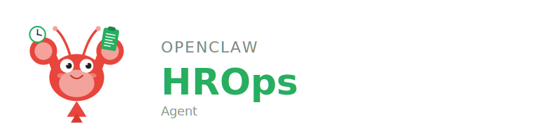

<p align="center">
  
</p>

# Workday / HROps

An [OpenClaw](https://docs.openclaw.ai/) agent that automates Workday HR operations through browser automation — not API calls. Handles task approvals with compliance checking against work council agreements (Betriebsvereinbarungen) and assists with time tracking per German labor regulations.

## Features

- **Task approvals** — Reviews pending HR tasks, checks compliance against work council agreements, and executes approvals with user confirmation
- **Time tracking** — Validates and assists with daily time entry per German labor regulations
- **Three-layer architecture** — Conversational agent, Elixir orchestrator, and headless browser (Playwright primary, CDP fallback)
- **Compliance-aware** — Reads Betriebsvereinbarungen from `company-norms/` (gitignored) for every decision

## Skills

| Skill | Description |
|-------|-------------|
| `task_approval_check` | Check whether a Workday task requires approval and retrieve its current status |

Workspace skills also available: `iamq_message_send`, `log_learning`, `improve_skill`

Skills auto-improve via post-execution hooks and nightly batch review.

## Architecture

- **Language**: Node.js/TypeScript (scripts), Python/Playwright (`tools/pipeline_runner/`), Elixir/OTP (`orchestrator/`)
- **IAMQ ID**: `workday_agent`
- **Runtime**: Docker (zero-install)

```
OpenClaw Agent (decisions, user confirmation)
  → Elixir Orchestrator (pipeline coordination, browser strategy)
  → Python/Playwright (headless browser, primary)
  → Node.js CDP relay (visible Chrome fallback for MFA)
```

IAMQ dual-mode transport: HTTP polling (`Orchestrator.MqClient`) + WebSocket (`Orchestrator.MqWsClient`).

## Setup

```bash
git clone https://github.com/r3dlex/openclaw-workday-agent.git
cd openclaw-workday-agent
cp .env.example .env
# Set WORKDAY_BASE_URL, Chrome CDP config, and IAMQ URLs
npm install
docker compose up -d
```

Place work council agreements in `company-norms/` (gitignored). See `spec/company-norms.md` for expected filenames.

### Docker Volume Mounts

```yaml
- ../skills-cli:/skills-cli:ro
- ../skills:/workspace/skills:rw
- ./skills:/agent/skills:rw
```

Environment: `EMBEDDINGS_URL=http://host.docker.internal:18795`

## Development

```bash
make test          # Run all tests (Python + Elixir)
make test-docker   # Zero-install Docker variant
make build         # Build all Docker images

# Legacy CDP relay (requires Chrome with DevTools Protocol)
docker compose run --rm agent node scripts/approve-workday.js
```

See `spec/ARCHITECTURE.md` for system design and `spec/PIPELINES.md` for pipeline definitions.

## Related

- [openclaw-inter-agent-message-queue](https://github.com/r3dlex/openclaw-inter-agent-message-queue) — IAMQ message bus and agent registry
- [openclaw-main-agent](https://github.com/r3dlex/openclaw-main-agent) — Cross-agent pipeline orchestrator

## License

MIT
